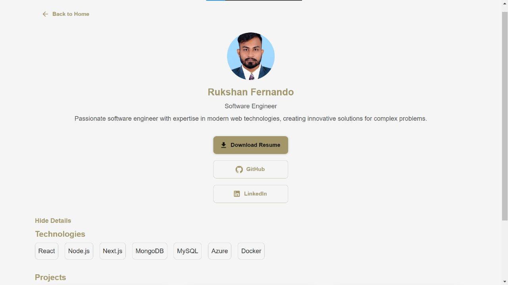

# Book Search App (BookBrowse-v1)

A simple book search application built with React, Vite, Material-UI (MUI), React Query, and utilizing the Google Books API for data fetching.

---

## Table of Contents

- [Introduction](#book-search-app-bookbrowse-v1)
- [Table of Contents](#table-of-contents)
- [Desktop Views](#desktop-views)
- [Mobile Views](#mobile-views)
- [Technologies Used](#technologies-used)
- [Project Setup](#project-setup)
- [File Structure](#file-structure)
- [Environment Variables](#environment-variables)
- [Usage](#usage)

---

## Desktop Views

Here are screenshots of the desktop version of the application:

### Home Page

<p align="center">
  
  
</p>

### About-me Page

<p align="center">
  
</p>

### Book Details

<p align="center">
  
</p>

---

## Mobile Views

Here are screenshots of the mobile version of the application:

### Home Page

<p align="center">
  
  
</p>

### About-me Page

<p align="center">
  
</p>

### Book Details

<p align="center">
  
</p>

---

## Technologies Used

- **React** - JavaScript library for building user interfaces.
- **Vite** - A modern, fast development tool for React.
- **MUI** (Material-UI) - A library of React components for faster and easier web development.
- **React Query** - A data-fetching and caching library for React.
- **Google Books API** - Used to fetch book data.
- **Toast** - For showing notifications and toasts.
- **.env** - For managing environment variables.

---

## Project Setup

To get started with this project, follow these steps:

1. Clone the repository:

   ```bash
   git clone https://github.com/NimeshRukshan/bookbrowse-v1.git
   cd bookbrowse-v1
   ```

2. Install the dependencies:

   ```bash
   npm install
   ```

3. Create a `.env` file in the root of the project and add the following environment variable:

   ```env
   REACT_APP_GOOGLE_BOOKS_API_KEY=your_google_books_api_key_here
   ```

4. Start the development server:

   ```bash
   npm run dev
   ```

5. Open your browser and visit `http://localhost:3000` to view the app.

---

## File Structure

```bash
src/
├── assets/            # Static assets such as images, icons, etc.
├── components/        # Reusable UI components
├── pages/
│   ├── Home.jsx       # Homepage component
│   ├── About.jsx      # About page component
│   └── BookDetails.jsx # Component displaying book details
├── routes/            # Routes for the application
│   └── router.js      # Defines routes for the application
├── services/          # API service for data fetching (e.g., Google Books API)
├── theme/             # Custom theme configuration for MUI
├── App.jsx            # Main component with layout and routing
└── main.jsx           # Main entry point for the React application
```

---

## Environment Variables

The following environment variable is required to use the Google Books API:

- **REACT_APP_GOOGLE_BOOKS_API_KEY**: Your API key for accessing the Google Books API. You can get your API key from [Google Cloud Console](https://console.developers.google.com/).

---

## Usage

1. **Fetching Data**:

   - The application uses React Query to fetch data from the Google Books API.
   - A custom service inside `src/services/` handles API requests to Google Books using the API key.

2. **Notification**:

   - Toast notifications are used to inform users of the app’s status (e.g., book search success or error).

3. **Styling**:

   - MUI is used for UI components like buttons, grids, and text fields.
   - Custom themes can be modified in `src/theme/`.

4. **Main Entry**:

   - The app is bootstrapped in `main.jsx`, which includes the `QueryClientProvider` for React Query, `ThemeProvider` for MUI, `RouterProvider` for routing, and `ToastContainer` for notifications.
   - The `App.jsx` component contains the layout, including the `Outlet` for nested routes and `CssBaseline` for consistent styling across browsers.

5. **Routing**:
   - The routing logic is defined in `src/routes/router.js`, which connects the routes to the respective components.

```

---

```
